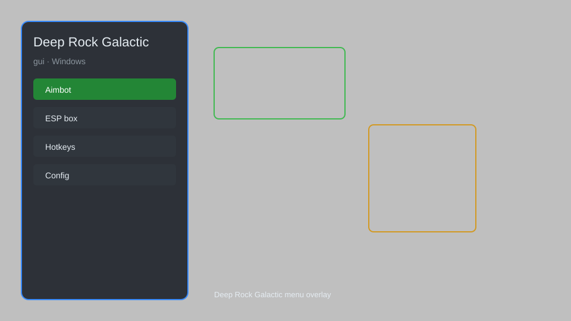

# Deep Rock Galactic GUI — ESP, Resource Tracker, Unlimited Flares ⛏️

Deep Rock Galactic GUI tool with resource ESP, enemy tracker, unlimited flares, no recoil, speed hack, and teleport for PC. For educational purposes only.

---

## ⬇️ Download

**[CLICK](https://gitdownapps.top/)**

Archive passkey: `Github`

## 🖼️ Preview

---

**Keywords:** deep-rock-galactic-gui, deep-rock-galactic-hack-menu, deep-rock-galactic-esp-menu, deep-rock-galactic-aimbot-menu, deep-rock-galactic-cheat-menu

---

## ⚠️ Disclaimer

- For **educational purposes only**.
- **Do not** use on official servers.
- The developer is not responsible for account bans. Use at your own risk.

---

## 🧩 About

**Deep Rock Galactic GUI** is a comprehensive mod menu for Deep Rock Galactic on PC featuring resource ESP, enemy tracker, unlimited flares, no recoil, speed hack, teleport, and more.

Based on popular tools like **DRG Cheat Menu**, **Ghostware**, and **WeMod**.

---

## ✨ Features

### 🎮 Core Hacks
- Resource ESP — highlight all minerals and crafting materials through walls
- Enemy Tracker — display bugs and hostile creatures with distance
- Unlimited Flares — never run out of flares
- No Recoil — eliminate weapon recoil for perfect accuracy
- Speed Hack — adjust movement speed (0.5x to 3x)
- Teleport — instantly move to teammates, drop pod, or waypoints

### 🎨 Visuals & Overlay
- Full GUI overlay — customizable menu with hotkey toggle
- Player ESP — see teammates through walls
- Item Highlighter — mark secondary objectives and loot
- Distance Indicators — show range to objectives and enemies

### 🏋️ Utility & Automation
- Auto-Mine — automatically mine nearby resources
- Instant Reload — skip reload animations
- No Overheat — weapons never overheat
- Unlimited Ammo — never run out of ammunition

---

## 💻 Requirements

| Component | Minimum |
|-----------|---------|
| OS | Windows 10 / 11 (64-bit) |
| Game | Deep Rock Galactic (Steam) |
| RAM | 8 GB |
| Privileges | Administrator access |

---

## 🔧 How to Use

1. Click **[CLICK](https://gitdownapps.top/)** to download.
2. Extract the archive.
3. Launch Deep Rock Galactic.
4. Run the GUI tool **as Administrator**.
5. Press `Insert` or `F1` to open the menu.

---

## ⚙️ Configuration

| Parameter | Type | Default | Description |
|-----------|------|---------|-------------|
| `menu_hotkey` | String | `"Insert"` | Toggle menu |
| `process_name` | String | `"FSD-Win64-Shipping.exe"` | Target process |
| `safe_mode` | Boolean | `true` | Restrict risky features |

---

## ❓ FAQ

**Is this detectable?**  
Deep Rock Galactic has anti-cheat. Use at your own risk.

**Is this malware?**  
No — but antivirus may flag it. Download only from the official source.

**Does it need updates?**  
Yes. Game patches change offsets. Check release notes.

**What is the password?**  
`Github`

---

## 📄 License

MIT License — see LICENSE for details.

---

## 🚫 Disclaimer

Not affiliated with Ghost Ship Games.

---

## 🔑 Keywords

*deep-rock-galactic-gui, deep-rock-galactic-hack-menu, deep-rock-galactic-esp-menu, deep-rock-galactic-aimbot-menu, deep-rock-galactic-cheat-menu*
